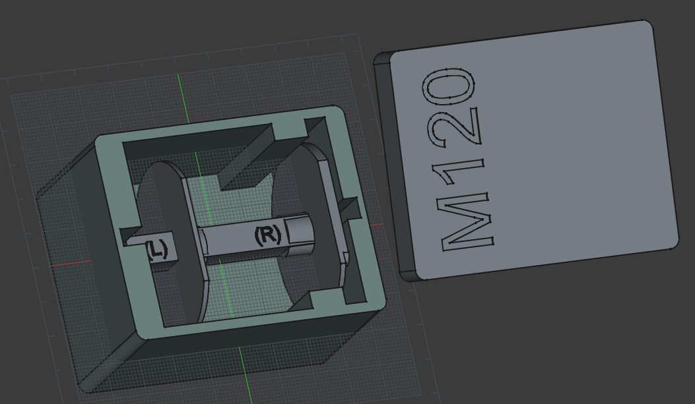

# Phomeno M120 Spool & Storage Box

Are you looking for a better way to organize your Phomemo M120 supplies? This project features a replacement spool for the Phomeno M120 thermal printer, along with a storage box to ... well, store it.

## Solution

If you have more than one type of label, changing them means opening the spool, removing the roll trying to not unroll it, storing it somewhere, remember where you put it, and so on.

This model consists of STL-files for additional label spools that you can keep the labels on while not in use and a dedicated container that holds the spool and label roll perfectly.

## Usage

Slide your label roll onto the replacement spool.

Insert the spool into the Phomemo M120 as you would the original.

When not in use, place the entire assembly into the storage box to protect the thermal paper from light and dust.

## Compatibility

- Printer: Phomeno M120 (may fit other models, but untested — let me know in the comments!).
- Label Width: Designed for standard rolls up to 50mm.

## Dimensions

- Box: 79 mm L x 64 mm W x 51,6 mm H
- Spool: 69 mm L x 50 mm W x 45 mm H

[Dimensions Spool Disc](TechDraw_Disc_right.pdf)

[Dimensions Axle](TechDraw_Axle.pdf)

## Assembly

### Spool

- While I prepared a stl file that combines two parts, I found it easier to print the three parts and glue the right disc to the axle.

- Unfortunately, using the same measures as the original, the little noses break way to easily when printed in PLA. So unlike the original part, this doesn't do much about holding the label roll in place. So you want to fixate the left disc with a few layers of adhesive tape behind it.

### Box

- Print out the box and the lid. No assembly needed.

- If you set a pause after the first printed layer, you can change your filament and have the "M120" in a different color.

Feel free to take my original FreeCAD model and add your improvements.

If you like this model, please post a make and leave your comments.

## Links

* stl files available also on [printables.com](https://www.printables.com/](https://www.printables.com/model/1537854-phomeno-m120-spool-storage-box) Please download and give a rating there, too.
* Source on [Github](https://github.com/bickerdyke/PhomenoM120-Spool/)

## License
- BSD-3-Clause license

## Tags

- Phomemo
- M120
- LabelPrinter
- Office
- Spool
